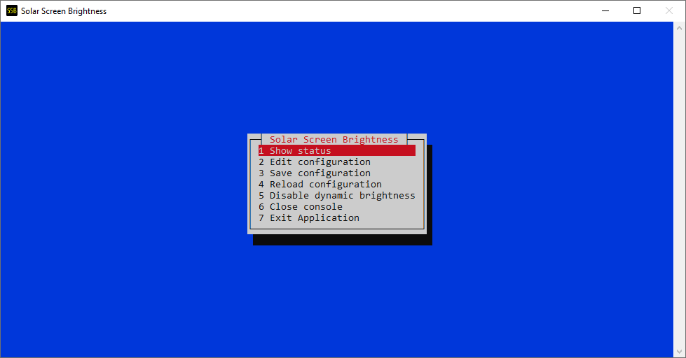
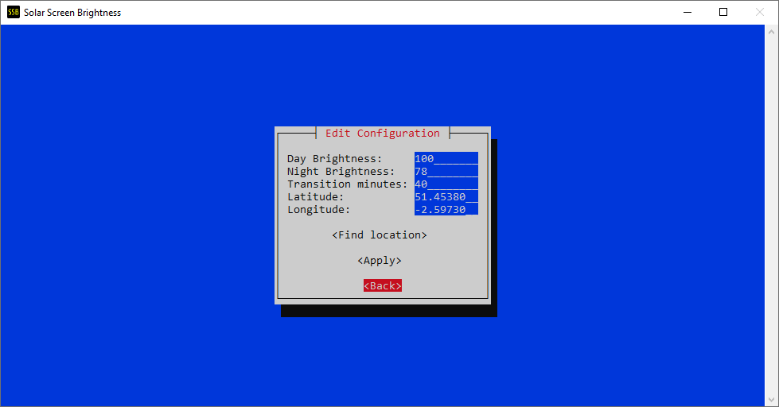

# Solar Screen Brightness

[](https://github.com/jacob-pro/solar-screen-brightness/actions)

Varies screen brightness according to sunrise/sunset times.

## About

#### What is this for?

Supports Windows and Linux computers. Recommended for desktop PCs where you don't have an ambient light sensor to
automatically adjust display brightness.

#### How is this different to [f.lux](https://justgetflux.com/) or similar Night Mode programs?

This changes the monitor screen brightness via monitor control APIs, 
whereas those utilities vary the colour tone of the display.

#### How to Use

1. An icon will appear in your tray when it is running.
2. Click on the icon to launch the console window.
3. Go into "Edit Configuration" and set:
    - Daytime and Nighttime brightness percentages.
    - Transition time (the time it takes to switch between the two brightness values at either sunset or sunrise).
    - Your location (either manually enter coordinates, or use "Find Location" to search online).
4. Click save and this configuration will be applied and persisted to disk.
5. You can close the console, and it will continue to update your brightness in the background.

(Note there are some more advanced options available via the CLI interface, 
try calling `solar_screen_brightness --help`)

#### Planned Features
- [ ] Per monitor/device brightness settings.
- [ ] macOS Support.

## Screenshots







## Development Setup

Note: CMake and Clang will also required to build the 
[sunrise-sunset-calculator](https://github.com/jacob-pro/sunrise-sunset-calculator/tree/master/rust-bindings) crate.

### Ubuntu

```
sudo apt update
sudo apt install -y libncurses-dev qtbase5-dev
```

### RHEL/CentOS/Oracle

```
sudo yum install -y ncurses-devel qt5-qtbase-devel
sudo ln -s /usr/bin/qmake-qt5 /usr/bin/qmake
```
