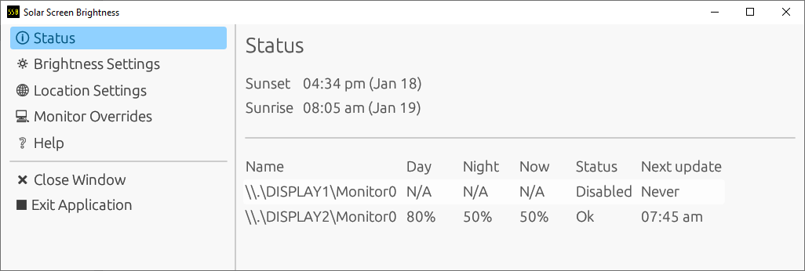
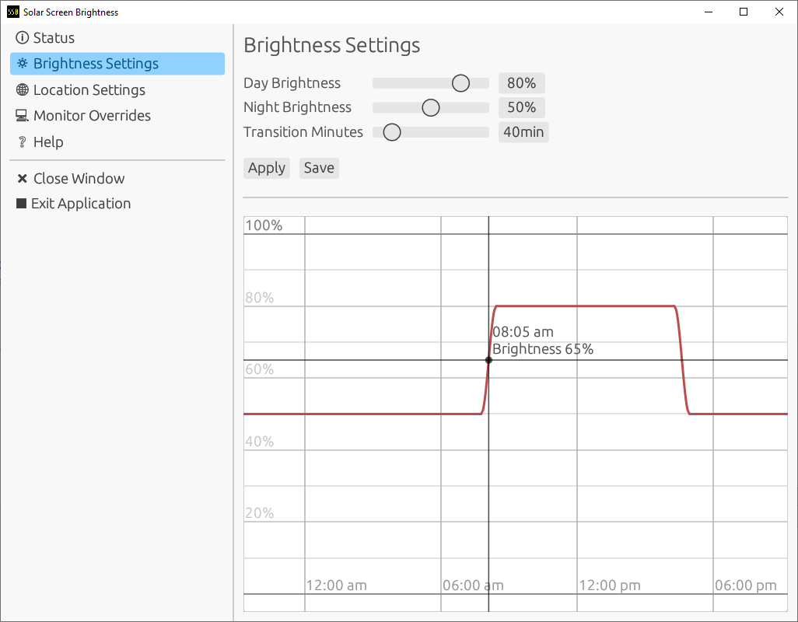

# Solar Screen Brightness

Varies screen brightness according to sunrise/sunset times.

> #### New 2.0 Release! 
> 
> I am pleased to announce a new 2.0 version with a modernised UI, new features, and bug fixes!

## About

### What is this for?

Supports Windows and Linux computers. Recommended for desktop PCs where you don't have an ambient light sensor to
automatically adjust screen brightness.

### How is this different to [f.lux](https://justgetflux.com/) or similar Night Mode programs?

This changes the screen brightness via monitor control APIs, whereas those utilities vary the colour temperature.

### How to Use

1. An icon will appear in your tray when it is running.
2. Click on the icon to launch the console window.
3. Use the menus to set:
    - Daytime and Nighttime brightness percentages.
    - Transition time (the time it takes to switch between the two brightness values at either sunset or sunrise).
    - Your location (either manually enter coordinates, or using the search tool).
4. Click save and this configuration will be applied and persisted to disk.
5. You can close the window, and it will continue to update your brightness in the background.

### How to Install

For Windows, you can download pre-compiled binaries from 
[Releases](https://github.com/jacob-pro/solar-screen-brightness/releases).

If you are using Linux, please read the [Linux Guide](docs/LINUX_GUIDE.md)

There is also a CLI only version of the application available.

## Screenshots

